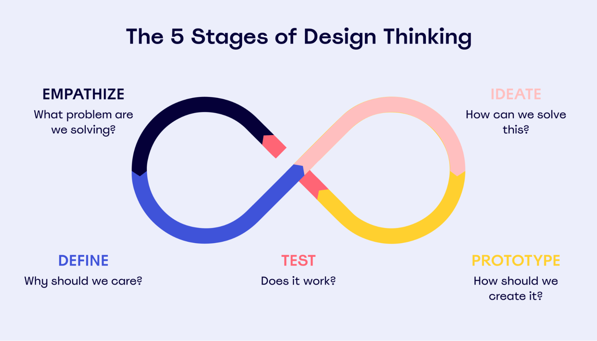

# Design Thinking et Industrialisation IA

## Structure du cours

Ce cours s'organisera en modules combinant théorie et pratique :

1. **Fondamentaux** : Principes du Design Thinking et bases de l'IA
2. **Études de cas** : Analyse de projets d'IA industrialisés réussis
3. **Ateliers pratiques** : Application de la méthode à des problématiques réelles avec emise en situation
4. **Évaluation** : Développement d'un projet de bout en bout

## Introduction

Ce cours va s'articuler autour de cas pratiques concrets. Chacun de ces cas devra suivre une approche Design Thinking et la solution apportée devra utiliser de l'IA à grande échelle. L'objectif est de comprendre comment les méthodologies de conception centrées sur l'humain peuvent s'allier aux technologies d'intelligence artificielle pour créer des solutions innovantes et industrialisables.

## Design Thinking

Le Design Thinking est une approche centrée sur l'humain qui permet de résoudre des problèmes complexes en cinq étapes clés :

1. **Empathie** : Comprendre profondément les besoins, les défis et le contexte des utilisateurs finaux
2. **Définition** : Synthétiser les découvertes pour formuler clairement le problème à résoudre
3. **Idéation** : Générer un large éventail d'idées et de solutions potentielles
4. **Prototypage** : Créer des représentations tangibles des solutions envisagées
5. **Test** : Évaluer les prototypes avec les utilisateurs finaux et itérer

Cette méthode favorise l'innovation en combinant créativité et rigueur analytique, tout en maintenant les besoins humains au centre du processus.

## Industrialisation IA

### Qu'entendons-nous par industrialisation IA ?

L'industrialisation de l'IA fait référence au processus de déploiement de solutions d'intelligence artificielle à grande échelle dans un environnement de production. Cela implique :

- **Mise à l'échelle** : Passer d'un prototype fonctionnel à une solution capable de gérer des volumes importants de données et d'utilisateurs
- **Automatisation** : Créer des pipelines de données et des processus ML/IA entièrement automatisés
- **Robustesse** : Garantir la fiabilité, la résilience et la sécurité des systèmes

### Enjeux de l'industrialisation

Pour qu'une solution IA soit véritablement industrialisable, elle doit répondre à plusieurs défis :

- **Qualité des données** : Assurer la disponibilité de données propres, pertinentes et représentatives
- **Évolutivité technique** : Concevoir des architectures capables d'évoluer avec les besoins
- **Maintenance et mise à jour** : Garantir la pérennité des modèles dans le temps
- **Conformité réglementaire** : S'assurer du respect des lois (RGPD, IA Act, etc.)
- **Acceptabilité** : Favoriser l'adoption par les utilisateurs finaux

## Critères d'évaluation

Votre travail sera évalué selon les critères suivants (sur 20 points) :

| Critère | Poids | Description |
|---------|-------|-------------|
| **Adéquation technique** | 2 | Les ressources, langages et outils proposés répondent aux besoins utilisateurs |
| **Ergonomie** | 1 | L'interface réalisée est ergonomique |
| **Visualisation des données** | 2 | Les visualisations sont adaptées, accessibles (RGAA) et utiles pour les métiers |
| **Conformité réglementaire** | 2 | Les contraintes réglementaires (RGPD, etc.) sont correctement identifiées |
| **Référentiel qualité** | 1 | Un référentiel qualité est rédigé pour garantir l'exploitation des données |
| **Analyse des risques** | 2 | Une analyse complète des risques est fournie, avec une politique de protection pertinente |
| **Analyse d'impact** | 2 | L'analyse des impacts (humains, sociétaux, environnementaux) est menée avec rigueur |
| **Comparaison stratégique** | 1 | Les options stratégiques sont comparées de façon argumentée (avantages/inconvénients) |
| **Communication** | 3 | Les résultats sont présentés de manière intelligible pour un public non spécialiste |
| **Présentation orale** | 4 | La présentation orale est structurée, couvre tous les sujets et respecte le temps imparti |
| **TOTAL** | 20 | |

### Livrables attendus

Pour chaque cas pratique, vous devrez produire :

- Une analyse complète des besoins utilisateurs
- Un prototype de solution intégrant de l'IA
- Une documentation technique détaillant l'architecture et les choix technologiques
- Une analyse des risques et des impacts
- Un référentiel qualité pour l'exploitation des données
- Une présentation orale destinée à des décideurs non techniques

## CAS 1 : FullWhere

**Profil** : Jeune startup innovante  
**Effectif** : 2 associés (moyenne d'âge : 27 ans)  
**Activité** : *FullWhere est conçu pour révolutionner la manière dont les entreprises interagissent avec leurs clients, en permettant une expérience client améliorée à chaque point de contact.*  
**Sujet** : Souhaite construire une base de connaissances pour tous les sites de ses clients. L'objectif est que lorsqu’un utilisateur pose une question à un assistant IA, ce dernier puisse répondre de manière fiable, sans risque d'hallucination.  
**Mots-clés** : Scraping, LLM, RAG

---

## CAS 2 : Carrefour Links

**Profil** : Filiale d'une société du CAC 40  
**Effectif** : 50 salariés (moyenne d'âge : 40 ans)  
**Activité** : *Carrefour Links aide les marques PGC à activer leur croissance grâce à la data, aux insights et à la collaboration.*  
**Sujet** : Carrefour Links dispose d’un large fichier Excel regroupant l’ensemble des produits vendus par Carrefour en France, ainsi que par chaque holding. L'objectif est de mettre à jour dynamiquement ce fichier afin qu’il reste à jour malgré les achats/ventes entre holdings.  
**Mots-clés** : Scraping, LLM, Actualité

---

## CAS 3 : Watchfid

**Profil** : PME  
**Effectif** : 3 associés (moyenne d'âge : 50 ans)  
**Activité** : *Watchfid offre un écosystème unique de montres, livres, conseils et contenus numériques pour les collectionneurs et passionnés. Explorez les dernières nouveautés, la montre de la semaine, la galerie d'art et le club Watchfid.*  
**Sujet** : Watchfid dispose d’un fichier Excel contenant un ensemble de montres avec des informations variées. Actuellement, l’un des associés effectue le reporting manuellement. Serait-il possible de récupérer ces données automatiquement depuis un site d’enchères ?  
**Mots-clés** : Scraping, LLM, Nettoyage de données